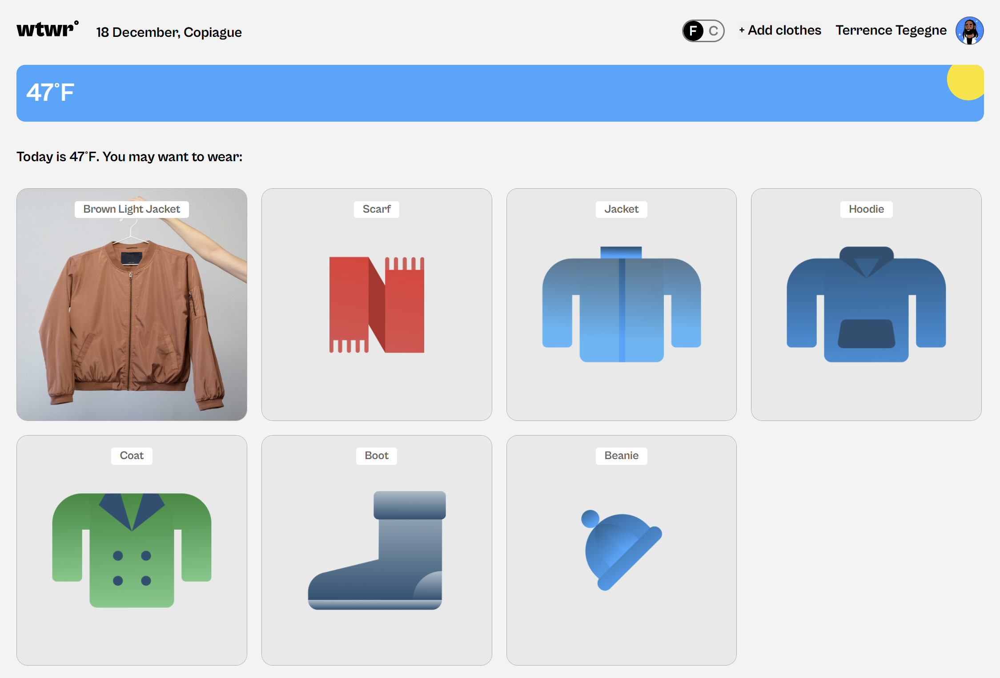
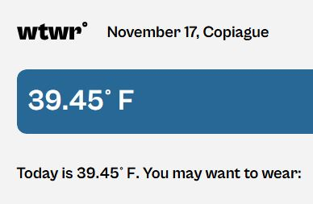
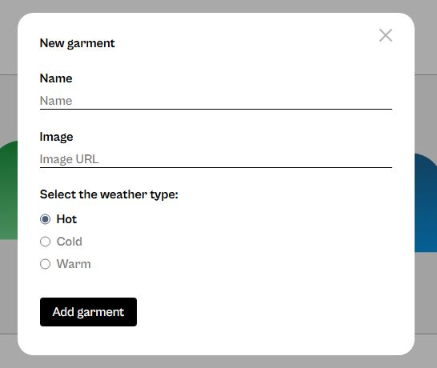
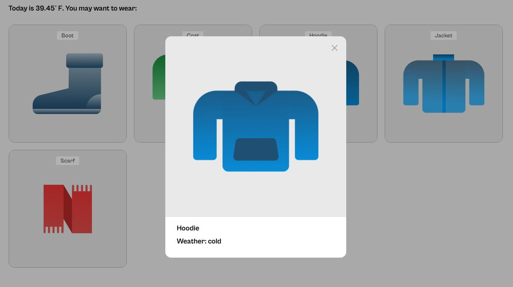

# Project 10: WTWR (What To Wear)

### Overview

- Intro
- Project links
- Project description
- Project features
- Figma
- Images
- Javascript Integration
- API integration
- Plan on improving project

**Intro**

This project delivers an interactive web application that helps users decide what to wear based on current weather conditions in a specified city. Users can manage a personal wardrobe of clothing items categorized by weather types (hot, warm, cold) and get recommendations for what to wear.

## Project links

Check out [this video](https://www.loom.com/share/394c2f47126c46a9a8fe5bace967e1ac) where I describe and showcase the project and explain some technologies used.

- [Github Page link to the project](https://ihekusmiles.github.io/se_project_react/)

## Project description

A weather-based clothing recommendation app that suggest appropriate garments based on current weather conditions. This project serves as a transition from a static front-end to a dynamic, API-driven application. A mock server (json-server) was used in order to fulfill API calls locally. Other web development technologies used include HTML, CSS, JavaScript, React, NPM, React Router, context API among others. Lastly, in addition to being able to add garments, users are also able to view a full collection of the garments submitted by visiting the profile page.

## Project features

- HTML5
- CSS
- JavaScript
- React
- API integration
- React Router
- API Calls

**Figma**

In order to make the layout, Figma was used to extract all the necessary design details, eg. font sizes, styles, padding/margin distances etc. The link below:

- [Link to the project on Figma](https://www.figma.com/design/dQLJwEKasIdspciJAJrCaf/Sprint-11_-WTWR?node-id=311-433&p=f&t=4VA4ucNNDJmrLTsF-0)

**Images**

The following screenshot shows what the page needs to look like at 1440px:

A users location is automatically detected and displayed here along with the city's current temperature:

Users will be able to add clothes depending on the weather using the +Add clothes. This button brings up a form:

Users can click on each card and preview a bigger version of it by clicking on it:

## Plan on improving project

- I will be adding responsive design in order to show this app correctly on mobile apps or smaller screens.
