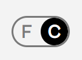
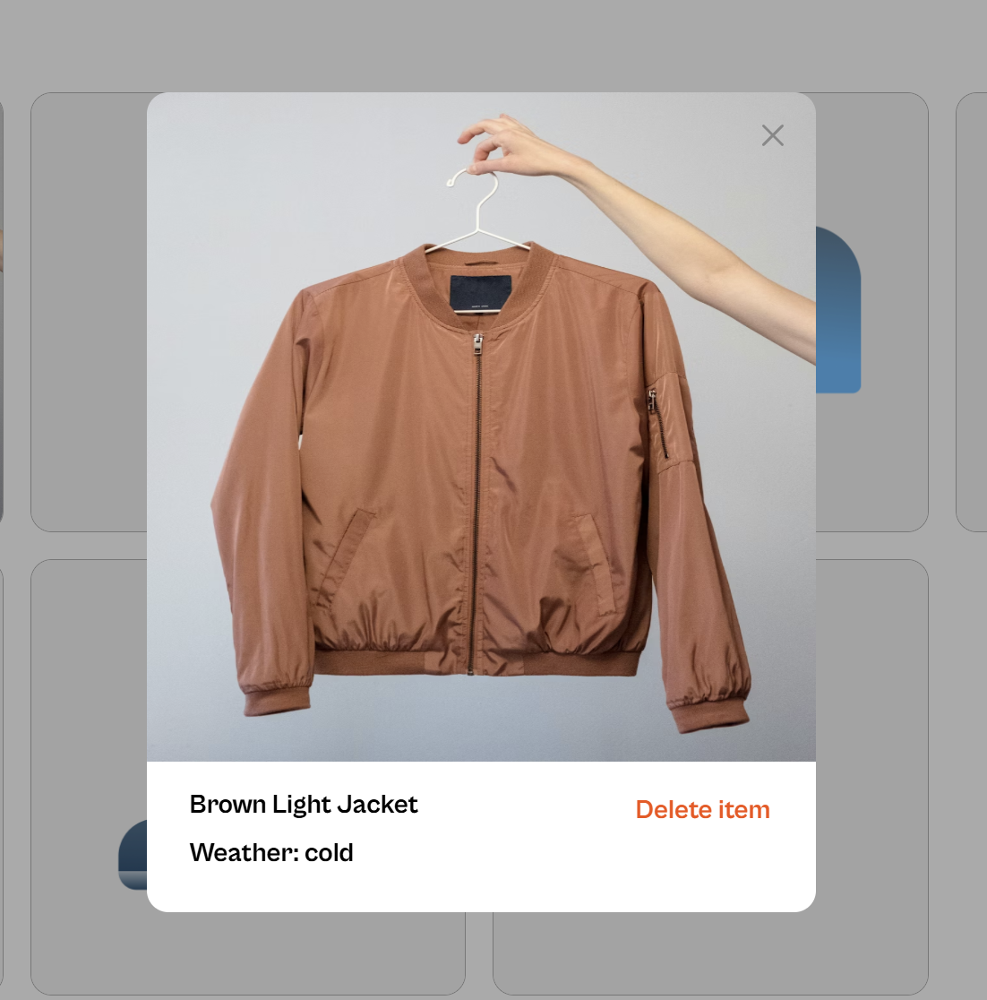
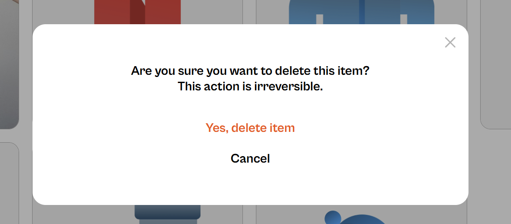
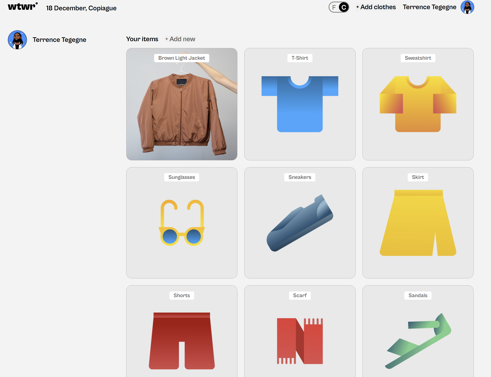
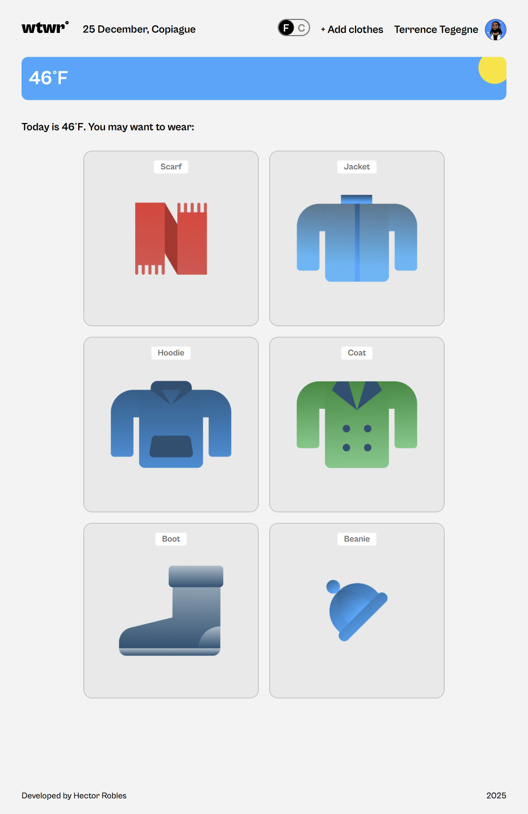
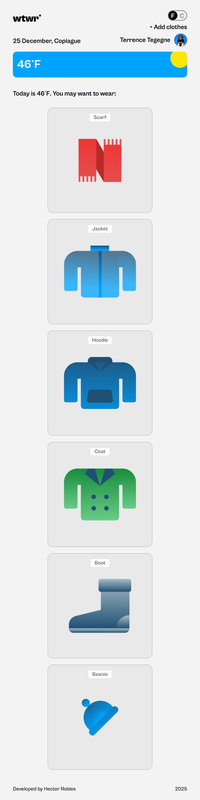
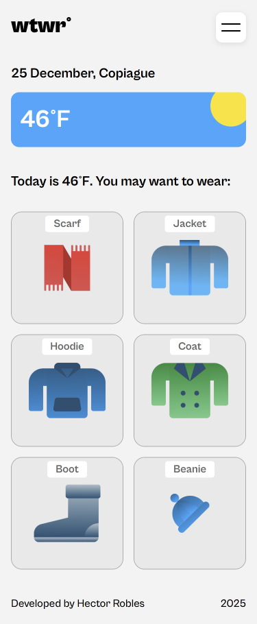
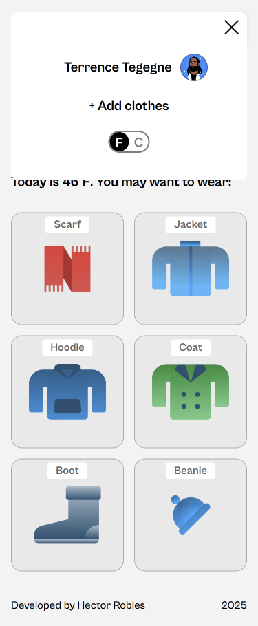
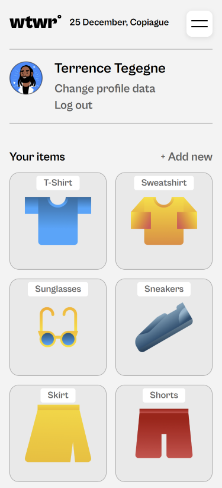

# Project 10: WTWR (What To Wear)

### Overview

- Intro
- Project links
- Project description
- Project features
- Figma
- App Images
- Responsive design
- Plan on improving project

**Intro**

This project delivers an interactive web application that helps users decide what to wear based on current weather conditions in a specified city. Users can manage a personal wardrobe of clothing items categorized by weather types (hot, warm, cold) and get recommendations for what to wear.

## Project links

Check out [this video](https://www.loom.com/share/394c2f47126c46a9a8fe5bace967e1ac) where I describe and showcase the project and explain some technologies used.

- [Github Page link to the project](https://ihekusmiles.github.io/se_project_react/)

## Project description

A weather-based clothing recommendation app that suggest appropriate garments based on current weather conditions. This project serves as a transition from a static front-end to a dynamic, API-driven application. A mock server (json-server) was used in order to fulfill API calls locally. Other web development technologies used include HTML, CSS, JavaScript, React, NPM, React Router, context API among others. Lastly, in addition to being able to add garments, users are also able to view a full collection of the garments submitted by visiting the profile page.

## Project features

- HTML5
- CSS
- JavaScript
- React
- API integration
- React Router
- API Calls

**Figma**

In order to make the layout, Figma was used to extract all the necessary design details, eg. font sizes, styles, padding/margin distances etc. The link below:

- [Link to the project on Figma](https://www.figma.com/design/dQLJwEKasIdspciJAJrCaf/Sprint-11_-WTWR?node-id=605-313&t=5B8d5FGDcFqI9EAi-0)

**App Images**

The main app at 1440px screen resolution:

A users location is automatically detected and displayed here along with the city's current temperature:

Users can toggle the temperature unit using the button:

Users are able to add their own clothes using the +Add clothes button, which brings up the form:

Users can preview each card in their wardrobe where they have the option to delete the card.

Additionally, a confirmation modal will open if the user decides to delete a card:

Clicking on the users name (top right corner) directs users to the profile page where they can view the entire wardrobe:

**Responsive Design**

Responsive design was implemented for various screen sizes. Elements were also placed differently depending on the screen size. The page at 840px:

The page at 621px:

Main page at mobile view (375px):

The main menu for mobile view:

Mobile view interface for profile page:

## Plan on improving project

- The ability to change profile's username.
- Log in and log out implementation.
